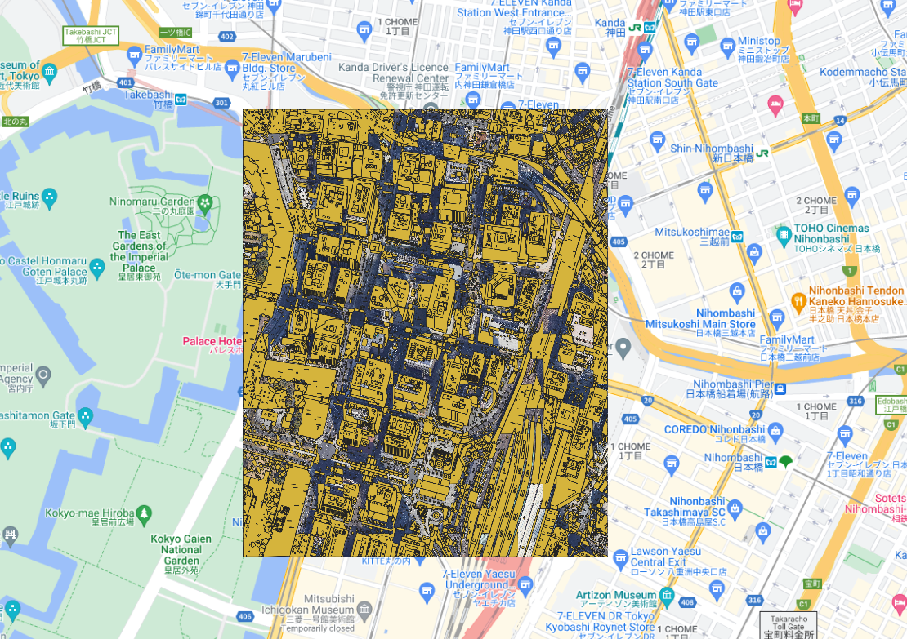

# Segment-Anything-Model-for-Geospatial-otemachi-example
Segment Anything Model for Geospatial otemachi example for Japanese.

### 説明記事
https://zenn.dev/syu_tan/articles/0b2d6a3e325d46

日本の大手町を Meta の SAM(Segment-Anything-Model) の地理拡張の `Segment Anything Model for Geospatial` を使って推論するデモ

